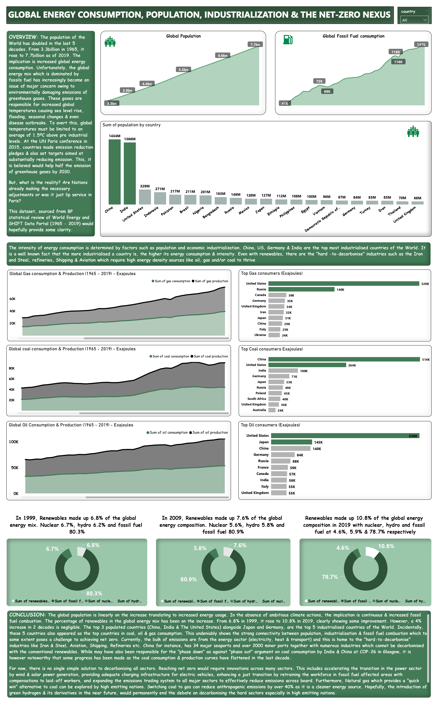

# GLOBAL-ENERGY-CONSUMPTION

## Introduction
The population of the World has doubled in the last 5 decades. From 3.3 billion in 1965, it rose to 7.7 billion ass of 2019. The implication is increased energy consumption. Unfortunately, the global energy mix which is dominated by fossil fuel has increasingly become an issue owing to the emission of environmentally damaging greenhouse gases. Sea level rise, seasonal changes and flooding have become prevalent in the last decade as a result of these emissions. To avert this, global temperatures must be limited to an average of 1.5-degree-Celsius above pre industrial levels. Emission reduction pledges aimed at halving greenhouse gas emsissions by 2030 were made by Nations at the UN Paris Conference in 2015. But, have Nations made adjustments in respect of these pledges?

## Problem Statement
- Has there been considerable progress in reducing global fossil fuel consumption?
- What is the current percentage of renewables in the energy mix?
- Which countries are the top consumers of fossil fuel and why so?
- Would all these pose a serious challenge to achieving net-zero?

## Data Sourcing
This dataset, sourced from BP statistical review of World Energy and SHIFT Data Portal (1965-2019) was made available by Quantum Analytics NG. It is a CSV file of 11,253 rows and 50 columns. 

## Data Transformation/Cleaning
The Data was transformed and cleaned on Power BI's Power Query Editor. Steps taken to wrangle, transform and clean the data includes:

- Used first row as column Headers
- Removed Duplicated columns
- Removed unwanted columns
- Replaced null or empty values
- Changed column data to corresponding data type  

## Data Modelling
Data modelling was not relevant to this analysis as the file is a single table document

## Visualization
Having completed the necessary cleaning to ensure data quality, the dashboard below was created using Power BI

you can interact with this dashboard [here](https://app.powerbi.com/groups/me/reports/d51c27f8-6c13-4e19-94b5-12f11dc98872/ReportSection?experience=power-bi)

## Conclusion 
The global population is increasing, and this places more pressure on energy. Incidentally, the top 3 most populated Countries were also the top nations in fossil fuel consumption. They are also richly endowed with high energy consuming industries such as the Shipping, Aviation, Iron and Steel which have been tagged the "hard-to-decarboise" sectors. These sectors thrive on high energy density. Although, renewables have increased in the global energy mix in the last 2 decades (6.8% in 1999 to 10.8% in 2019). However, the absence of clean alternatives to the "hard-to-decarbonise" sectors, poses a challenge to achieving net-zero as they are the highest emitting sources.

## Recommendation
There is no single solution to decarbonising every sector. Nonetheless, the following recommendations can be adopted by nations as a step forward:

- Accelerating transition in the Power sector through renewables like wind and solar
- Expanding emission trading to all major sectors to reduce emissions
- Transitioning from coal to gas especially by high emitting nations. Gas reduces anthrogenic emissions by 40% in comparison to Coal. This switch from coal to gas was hugely responsible for the reduction in UK's emssions in the last decade.
  

